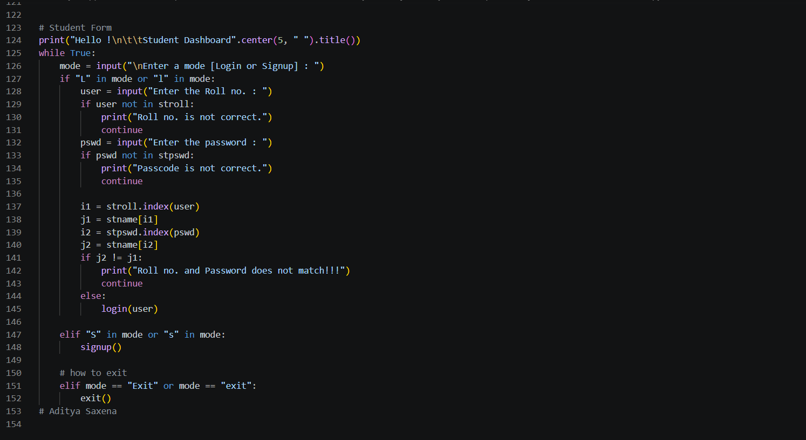
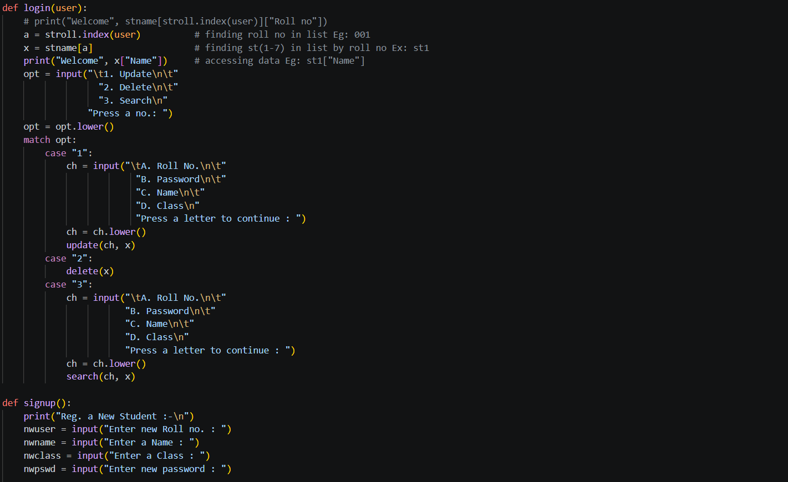

# 🎓 Student Dashboard Management System


---

# 📌 Project Overview

The Student Dashboard Management System is a Python-based command-line application designed to simulate a lightweight educational management platform.

The system allows users to:

- Register new students
- Authenticate users using roll numbers and passwords
- Search student information
- Update student records
- Delete student profiles

This project demonstrates practical implementation of:

- CRUD operations
- Authentication workflows
- Modular Python programming
- Data structure management
- Interactive command-line applications

    

---

# 🚀 Features

## Authentication System
- Login validation
- Password verification
- Student registration workflow

## Student Management
- Create student profiles
- Search student information
- Update existing records
- Delete student data

## CLI Interaction
- Interactive menu navigation
- Match-case routing
- Dynamic workflow handling

---

# 🧠 Business Problem

Educational institutions often require lightweight systems to manage student information efficiently. This project demonstrates how a simplified management dashboard can be implemented using core Python concepts while maintaining modularity and usability.

---

# ⚙️ Tech Stack

| Category | Technologies |
|---|---|
| Language | Python |
| Architecture | Procedural Programming |
| Storage | In-Memory Dictionaries & Lists |
| Interface | Command-Line Interface |
| Version Control | Git & GitHub |

---

# ▶️ Installation & Usage

## Clone Repository

```bash
git clone https://github.com/aadii2556/student-dashboard-management-system.git

```

## Run Application

```bash
python student_dashboard.py
```

---

# 🔄 Workflow

```text
User Login / Signup
        ↓
Authentication
        ↓
Student Dashboard
        ↓
CRUD Operations
        ↓
Updated Student Records
```

---

# 📈 Learning Outcomes

This project helped strengthen understanding of:

- Python dictionaries and lists
- Functional decomposition
- Authentication logic
- CRUD architecture
- Interactive application workflows
- Data validation concepts

---

# 🛠 Future Improvements

## Planned Enhancements

- SQLite database integration
- Password hashing using bcrypt
- GUI version using Tkinter or PyQt
- Flask web application version
- REST API integration
- Cloud deployment
- Student analytics dashboard
- Logging and monitoring
- Unit testing

---

# 📊 Portfolio Positioning

This project demonstrates foundational software engineering concepts including:

- Authentication systems
- CRUD application architecture
- Structured programming
- Interactive CLI workflows
- Data management logic

Suitable for:

- Python portfolios
- Beginner software engineering showcases
- GitHub project demonstrations
- Internship applications

---

# 👨‍💻 Author

## Aditya Saxena

B.Tech Data Science Student
Python Developer | Data Analytics Enthusiast | Software Engineering Learner

---

# 📜 License

This project is licensed under the MIT License.

---

# ⭐ Repository Topics

```text
python
student-management-system
crud-application
cli-application
python-project
education-tech
authentication-system
software-engineering
```
